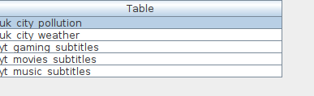
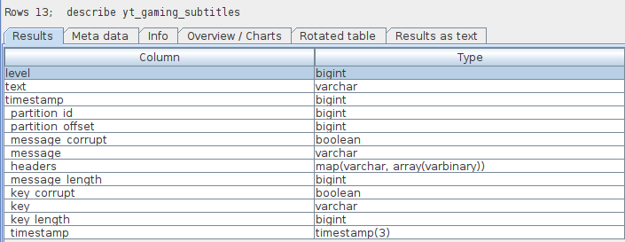
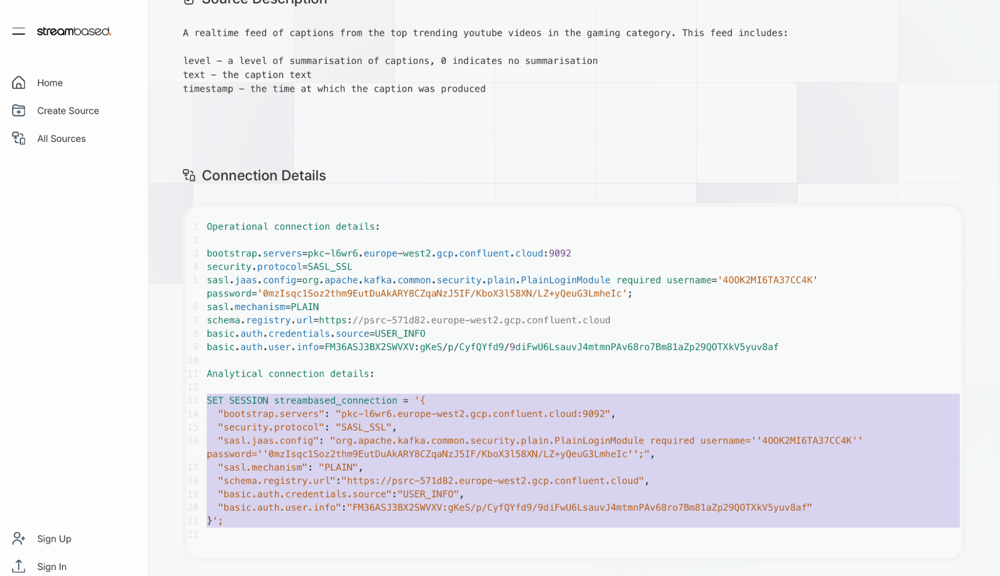
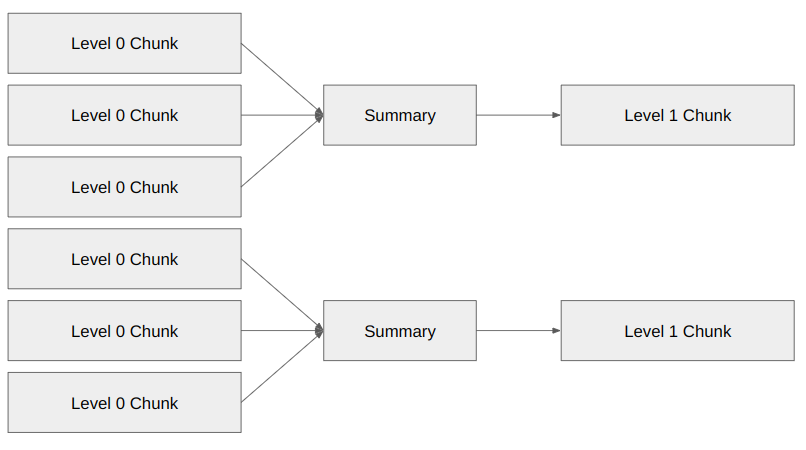
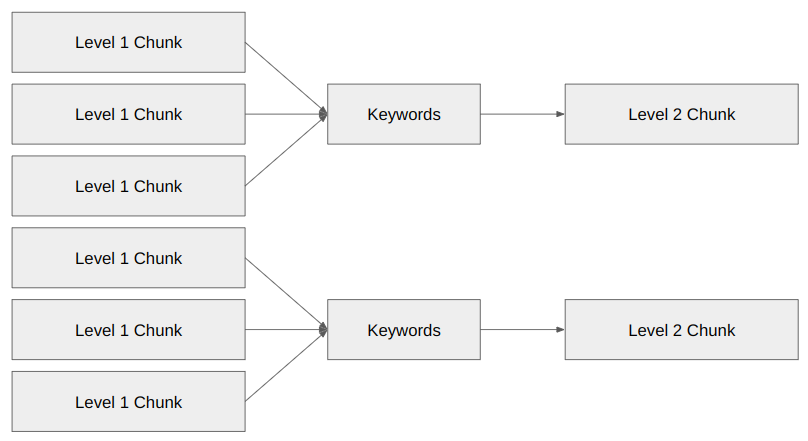
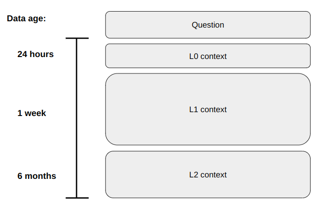

# Hands on! Using real time data in AI models


## Overview

This workshop will introduce realtime data as a key ally in developing AI models. We will cover realtime data structure, common patterns and common technologies used to hand realtime data. We will utilise the tools and techniques with which you are comfortable to explore realtime data so that it can be seamlessly integrated into your development workflow.

The jewel of the session will be the development of a hierarchical condensation RAG based model utilising an open source realtime dataset to create a chatbot able to answer detailed questions around the current themes in the gaming community today.

### Learning Outcomes

By the end of this session you will:

* Understand the core language and concepts of realtime data.  
* Be able to discover, explore and prepare a realtime data source for RAG  
* Use Python within a Jupyter notebook to enhance a prompt with realtime data

## Preparation

**Prerequisites**

1. A SQL client capable of connecting via JDBC or SQL Alchemy (we recommend [SQuirreL Sql](https://squirrel-sql.sourceforge.io/)). Streambased provides connection guides here: [https://www.streambased.io/tutorial-guides](https://www.streambased.io/tutorial-guides)  
2. A Jupyter Notebook with jupysql and sqlalchemy-trino packages installed. A guide to this can be found here: [https://www.streambased.io/tutorial-guides/jupyter](https://www.streambased.io/tutorial-guides/jupyter)

These are the required packages for this workshop
```bash
pip install trino  
pip install sqlalchemy-trino  
pip install pandas  
pip install -U Cython  
pip install numpy scipy scikit-learn matplotlib  
pip install openai
```

A short presentation on the goal and methodology for this workshop can be found here: [Link](https://docs.google.com/presentation/d/18EeVRAXzRPS_8zP5kws76Gup7fv-h70uyBTXJLA_Yyw/edit?usp=sharing)

### CHAPTER 1: Bring me realtime!

**Step 0: Goal and methodology**

In this chapter we will learn how to query the data that is present in Apache kafka. 

To get an overview of Kafka data, we can map Kafka concepts to more familiar relational database terms:

* **Topic** becomes a **Table**
* **Message** corresponds to a **Row**
* **Field** maps to a **Column**

By using this mapping, listing Kafka topics is conceptually similar to listing database tables. Each topic represents a set of messages (rows) that share a common structure, much like how a table contains rows with consistent columns.

This approach provides a clear and structured way to think about Kafka topics and their data, making it easier to reason about and work with the information.

**Step 1: Discover the data set**

The data set we are working with is a publicly available set of captions from trending Youtube videos. It is made available via the open Streambased RDx realtime data marketplace at rdx.streambased.cloud.

[Streambased RDx](https://rdx.streambased.cloud/) provides a free and open source of realtime data feeds in Kafka format. Please take some time to browse the feeds available. Each feed gives the following information:

1. A feed name  
2. A short description of the data in the feed - Good versions of these include a description of the structure of messages in the feed. If not don’t worry, we’ll look at this via Schema Registry later  
3. The topic the feed relates to - A Kafka topic name for the feed data, more on this later  
4. Connection details - Instructions on how to connect to the Kafka cluster that hosts this feed. 

The feed we are interested in is named “Youtube Gaming Subtitles” and can be found in the “Web and Tech” category. Under connection details you should see two sets of connection details:

1. Operational connection details - these can be used to investigate the data for operational purposes  
   
```
`bootstrap.servers=pkc-l6wr6.europe-west2.gcp.confluent.cloud:9092`  
`security.protocol=SASL_SSL`  
`sasl.jaas.config=org.apache.kafka.common.security.plain.PlainLoginModule required username=XXXXXX password='XXXXXXX';`  
`sasl.mechanism=PLAIN`
```

2. Analytical connection details - these are to be used with analytical tooling for more complex, SQL based queries.   
   
```
`SET SESSION streambased_connection = '{`  
  `"bootstrap.servers": "pkc-l6wr6.europe-west2.gcp.confluent.cloud:9092",`  
  `"security.protocol": "SASL_SSL",`  
  `"sasl.jaas.config": "org.apache.kafka.common.security.plain.PlainLoginModule required username=''XXXXXXXXXXXX'' password=''XXXXXXXXX'';",`  
  `"sasl.mechanism": "PLAIN",`  
  `"schema.registry.url":"https://psrc-571d82.europe-west2.gcp.confluent.cloud",`  
  `"basic.auth.credentials.source":"USER_INFO",`  
  `"basic.auth.user.info":"XXXXXX"`  
`}';`
```
Copy the analytical connection details for later use.

**Step 2: Explore the data using analytical tools**

Note: This section uses Streambased A.S.K., a free, hosted analytical tool for Kafka based on the open source Trino project. 

Streambased A.S.K. offers a JDBC/ODBC/SQL Alchemy connection and so can be integrate with most analytical tools. We love the simplicity of [SquirrelSQL](https://squirrel-sql.sourceforge.io/) but feel free to follow the guides below to connect the tool of your choice.

[https://www.streambased.io/tutorial-guides](https://www.streambased.io/tutorial-guides)

Remember the analytical connection details we collected from RDx? We can apply these with a single command in our SQL tool to repoint A.S.K. at our Kafka data.

```
`SET SESSION streambased_connection = '{`  
  `"bootstrap.servers": "pkc-l6wr6.europe-west2.gcp.confluent.cloud:9092",`  
  `"security.protocol": "SASL_SSL",`  
  `"sasl.jaas.config": "org.apache.kafka.common.security.plain.PlainLoginModule required username=''XXXXXXXXXXXX'' password=''XXXXXXXXX'';",`  
  `"sasl.mechanism": "PLAIN",`  
  `"schema.registry.url":"https://psrc-571d82.europe-west2.gcp.confluent.cloud",`  
  `"basic.auth.credentials.source":"USER_INFO",`  
  `"basic.auth.user.info":"XXXXXX"`  
`}';`
```


1. Listing Topics \- To list all available topics, simply use the following command:

`show tables;`



2. Viewing message structure \- as with listing, the topic/table duality means that viewing the structure of a message is as simple as describing the table:

`DESCRIBE yt_gaming_subtitles;`



Note: any column beginning with an underscore is an internal column that reflects Kafka specific metadata. These columns can be used in queries just like any other. 

3. Fetching some data \- now we can explore the Kafka data in the same way that we would any other SQL based resource:

`SELECT * FROM yt_gaming_subtitles LIMIT 100;`


**CHAPTER 2: Realtime and RAG**

**Setting up Jupyter notebook:-**  
 
 Go to terminal and install the following package 

* pip install sqlalchemy-trino  
* pip install openai 


***Step 0: The AI case***

Our case is that we are an Indie games company looking for new ideas to develop into a blockbuster title\! We have decided to employ the help of AI and realtime data to identify what features/aspects our game should have to be most successful.

Thanks to Streambased RDx we already have a realtime feed of subtitles from the top trending gaming videos. This is an excellent resource to interrogate to find our answers. We will employ RAG here with the prompt: 

“What are the recent and enduring trends in the field of gaming?”

Unfortunately we have hit a snag, there is far too much realtime data to include in the prompt. To address this we’re going to use a technique called Hierarchical Summarisation RAG that lends itself to working with realtime data. This will reduce the amount of data to be added to the prompt whilst minimising knowledge loss in order to give us a comprehensive answer.

To get the real time dataset please visit streambased rdx website ( rdx.streambased.cloud ) and get the connection details of the data set the picture below shows you the website and where to get connection details from copy the selected details as shown in the picture below



After copying the connection details lets head to the jupyter notebook and make a sql connection using the sql alchemy trino package. We are going to use streambased ASK to as query engine to query the data from kafka to your jupyter notebook. Code snippet is attached below to show you how to connect the real time data and query it into your jupyter notebook

```python
import os  
from openai import OpenAI  
import openai  
import json  
from sqlalchemy.engine import create_engine  
from sqlalchemy import text  
import pandas as pd  
import time  
from pandas import DataFrame  
import random
```

```python
"""A utility function to setup the connection to the realtime source"""

def create_kafka_engine(connection_params: str):  
    
   connect_args = {  
       "session_properties": {"streambased_connection": connection_params, "use_streambased": True},  
       "http_scheme": "https",  
       "schema": "streambased"  
   }  
    
   engine = create_engine("trino://streambased.cloud:8443/kafka", connect_args=connect_args)  
    
   return engine
```  

Paste the connection details under the connection params

```python
"""Make a connection for the realtime source"""

connection_params = """{  
 "bootstrap.servers": "pkc-l6wr6.europe-west2.gcp.confluent.cloud:9092",  
 "security.protocol": "SASL_SSL",  
 "sasl.jaas.config": "org.apache.kafka.common.security.plain.PlainLoginModule required username='4OOK2MI6TA37CC4K' password='0mzIsqc1Soz2thm9EutDuAkARY8CZqaNzJ5IF/KboX3l58XN/LZ+yQeuG3LmheIc';",  
 "sasl.mechanism": "PLAIN",  
 "schema.registry.url":"https://psrc-571d82.europe-west2.gcp.confluent.cloud",  
 "basic.auth.credentials.source":"USER_INFO",  
 "basic.auth.user.info":"FM36ASJ3BX2SWVXV:gKeS/p/CyfQYfd9/9diFwU6LsauvJ4mtmnPAv68ro7Bm81aZp29QOTXkV5yuv8af"  
}"""

engine = create_kafka_engine(connection_params)  
connection = engine.connect()
```
   
***Step 1: Chunking the data*** 

**FYI: From now on all steps take place within a Jupyter notebook. A completed template can be found here: [Jupyter Notebook](notebooks/workshop.ipynb)**

In this step we will pull out time bound sections of the realtime stream and store them for processing later. This can be done with a simple SQL query in the form:

```
chunk = %sql SELECT text FROM yt_gaming_subtitles WHERE timestamp > 1725526800 AND timestamp < 1725536800
```

You will see a number of executions of this type in the accompanying template.

For this workshop we have taken the data of gaming subtitle for 7 days and split them into 7 dataframe 1 for each day so that it’s easier to perform summarization on it.

```python
"""Prepare 7 days worth of queries"""

current_timestamp = int(time.time()*1000)  
day1_timestamp = current_timestamp - 86400000  
day2_timestamp = day1_timestamp - 86400000  
day3_timestamp = day2_timestamp - 86400000  
day4_timestamp = day3_timestamp - 86400000  
day5_timestamp = day4_timestamp - 86400000  
day6_timestamp = day5_timestamp - 86400000  
day7_timestamp = day6_timestamp - 86400000

"""We limit the rows returned for demo performance reasons"""

day1_query = f"SELECT * FROM yt_gaming_subtitles WHERE timestamp > {day1_timestamp} AND timestamp < {current_timestamp} LIMIT 5000"  
day2_query = f"SELECT * FROM yt_gaming_subtitles WHERE timestamp > {day2_timestamp} AND timestamp < {day1_timestamp} LIMIT 5000"  
day3_query = f"SELECT * FROM yt_gaming_subtitles WHERE timestamp > {day3_timestamp} AND timestamp < {day2_timestamp} LIMIT 5000"  
day4_query = f"SELECT * FROM yt_gaming_subtitles WHERE timestamp > {day4_timestamp} AND timestamp < {day3_timestamp} LIMIT 5000"  
day5_query = f"SELECT * FROM yt_gaming_subtitles WHERE timestamp > {day5_timestamp} AND timestamp < {day4_timestamp} LIMIT 5000"  
day6_query = f"SELECT * FROM yt_gaming_subtitles WHERE timestamp > {day6_timestamp} AND timestamp < {day5_timestamp} LIMIT 5000"  
day7_query = f"SELECT * FROM yt_gaming_subtitles WHERE timestamp > {day7_timestamp} AND timestamp < {day6_timestamp} LIMIT 5000"
```


```python
"""Execute 7 days worth of queries - in production this would be executed asynchronously and continuously"""

connection = engine.connect()

%reload_ext sql  
%sql engine

rs = connection.execute(text(day1_query))  
day1_l0_df = DataFrame(rs.fetchall())  
day1_l0_df.columns = rs.keys()

rs = connection.execute(text(day2_query))  
day2_l0_df = DataFrame(rs.fetchall())  
day2_l0_df.columns = rs.keys()

rs = connection.execute(text(day3_query))  
day3_l0_df = DataFrame(rs.fetchall())  
day3_l0_df.columns = rs.keys()

rs = connection.execute(text(day4_query))  
day4_l0_df = DataFrame(rs.fetchall())  
day4_l0_df.columns = rs.keys()

rs = connection.execute(text(day5_query))  
day5_l0_df = DataFrame(rs.fetchall())  
day5_l0_df.columns = rs.keys()

rs = connection.execute(text(day6_query))  
day6_l0_df = DataFrame(rs.fetchall())  
day6_l0_df.columns = rs.keys()

rs = connection.execute(text(day7_query))  
day7_l0_df = DataFrame(rs.fetchall())  
day7_l0_df.columns = rs.keys()
```


***Step 4: Summarising***

The above chunks form our level 0 dataset but the combination of all chunks creates a context that is too large to be added to our LLM prompt. To address this we will ask the LLM to summarise the content of multiple chunks into a smaller set of level 1 chunks. E.g.:


This creates a smaller, less detailed dataset we can use with our prompt. We can repeat this step to continue minimising the context data and even change the summarization technique to create a varied set of chunks we can use to make up our context. In this workshop we will only continue summarisation to level 2 and will use keyword extraction as our technique here:



The levels of summarization has to be determined by the amount of data that we are dealing with and also the token size that can be processed by the LLM but in this workshop we have used a relatively small amount of data and summerized it you can see how we did it in the code shown below 

```python
"""Level 1 summarisation: we take 1 day's worth of captions and summarise them to 1000 words"""

day2_l1_prompt = f"""I have provided the input of the youtube gaming subtitles for a single day please summmarise  
it to 1000 words and make sure you don't leave important stuff out. The captions are: {' '.join(day2_l0_df["text"].dropna())}"""  
day2_l1_summary = llm_model(day2_l1_prompt)

day3_l1_prompt = f"""I have provided the input of the youtube gaming subtitles for a single day please summmarise  
it to 1000 words and make sure you don't leave important stuff out. The captions are: {' '.join(day3_l0_df["text"].dropna())}"""  
day3_l1_summary = llm_model(day3_l1_prompt)

"""Level 2 summarisation: we take 1 day's worth of captions and extract 100 keywords"""

day4_l2_prompt = f"""I have provided the input of the youtube gaming subtitles for a single day please extract 100 keywords from it. The captions are: {' '.join(day4_l0_df["text"].dropna())}"""  
day4_l2_summary = llm_model(day4_l2_prompt)

day5_l2_prompt = f"""I have provided the input of the youtube gaming subtitles for a single day please extract 100 keywords from it. The captions are: {' '.join(day5_l0_df["text"].dropna())}"""  
day5_l2_summary = llm_model(day5_l2_prompt)

day6_l2_prompt = f"""I have provided the input of the youtube gaming subtitles for a single day please extract 100 keywords from it. The captions are: {' '.join(day6_l0_df["text"].dropna())}"""  
day6_l2_summary = llm_model(day6_l2_prompt)

day7_l2_prompt = f"""I have provided the input of the youtube gaming subtitles for a single day please extract 100 keywords from it. The captions are: {' '.join(day7_l0_df["text"].dropna())}"""  
day7_l2_summary = llm_model(day7_l2_prompt)
```

***Step 5: Composition***

With all of these chunks defined we can build up a suitable prompt. The context data that goes into the prompt can be drawn from level 0, level 1 or level 2 and the composition should be tailored to the data set. A common starting approach is to mimic human memory and using the most detail level 0 data for the most recent events and the level 2 data for the most historical:



But to keep our workshop simpler we are gonna make it leaner but converting L0 - 24hr, L1 - Day 2 Day3, L2- Day 4 Day 5 Day 6 Day 7

***Step 6: Workflow***

Now let’s execute our assembled prompt against the LLM\!

**NOTE:- Please get the api key from your preferred llm vendor for this example I have chosen openAI api.**

```python
"""A utility function to execute prompts against the LLM"""

def llm_model(prompt):  
   client = OpenAI(api_key="**INSERT THE KEY HERE**")  
   try:  
       response =client.chat.completions.create(  
           model="gpt-4o-mini",  
           messages=[{"role": "system", "content": "You have an extensive knowledge on english and have an amazing skill to summarise documents without losing important information and delvireing the content in a very consize way"},  
                     {"role": "user", "content": prompt}]  
       )  
       response_message = response.choices[0].message.content  
       return response_message  
   except openai.OpenAIError as e:  
       print(f"OpenAI API error: {e}")  
       return "Error with OpenAI API"  
   except Exception as e:  
       print(f"General error: {e}")  
       return "General error in classification"
```

Pass the prompt as shown below by inserting the summarization data with it 

```python
"""Now we can compose a prompt"""

prompt = f"""I have provided captions from Youtube gaming videos from the last day here:

{' '.join(day1_l0_df["text"].dropna())}.

#I have also provided a sumary of Youtube gaming videos from 24 to 72hrs ago here:

{day2_l1_summary}  
{day3_l1_summary}

#I have also provided keywords extracted from Youtube gaming videos older than 72hrs here:

{day4_l2_summary}  
{day5_l2_summary}  
{day6_l2_summary}  
{day7_l2_summary}

#Use this information to answer the user's question. The user's question is what are the latest and enduring trends in the gaming field?

print(f"Composed a prompt with length: {len(prompt.split())}")

"""Execute the prompt against the LLM"""

result = llm_model(prompt)  
print(result)
```

***Step 7: Experiment\!***

In this step we have   
In the above steps we have established a technique for extracting real time data and using it for RAG. Experiment with different summarisation techniques and different compositions in order to get the best results from our test dataset.

Example1:-  
Using top K or raw data as an input data  

```python
"""Let's compare with a similar prompt size with a lot less detail"""

top_k_selections = [day1_l0_df,day2_l0_df,day3_l0_df,day4_l0_df,day5_l0_df,day6_l0_df,day7_l0_df]  
top_k_df_1 = random.choice(top_k_selections)  
top_k_df_2 = random.choice(top_k_selections)

bad_prompt = f"""I have provided captions from Youtube gaming videos here:

{' '.join(top_k_df_1["text"].dropna())}  
{' '.join(top_k_df_2["text"].dropna())}

Use this information to answer the user's question. The user's question is what are the latest and enduring trends in the gaming field?"""

"""Execute the bad prompt against the LLM"""

bad_result = llm_model(bad_prompt)  
print(bad_result)
```

Example2:-   
Using the LLM without any data 

```python
raw_prompt = "what are the latest and enduring trends in the gaming field?"  
raw_result = llm_model(raw_prompt)

print(raw_result)
```


