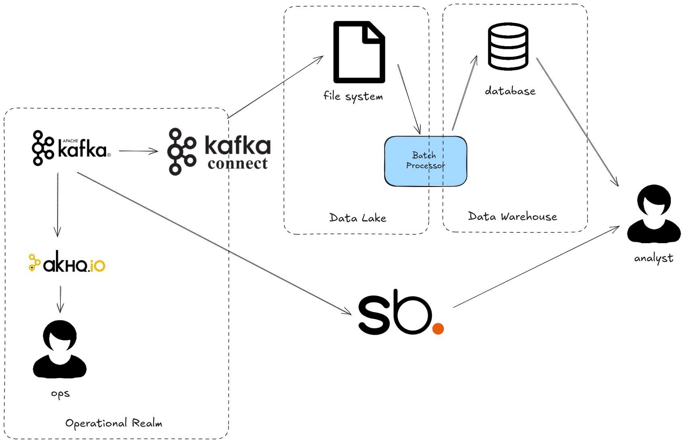

# The Slow Data Problem

What is the e2e latency of your data? By this we mean after a datapoint is created, how long does it 
take for it to be available for analytics? Hours? Days? Weeks? If it's larger than zero you need 
Streambased.

## Environment

This demo simulates a typical e2e data flow from creation in Kafka through to use for analytics. An 
architecture diagram can be seen below:



All of this is exists in a single docker-compose environment containing:

* kafka1, zookeeper and schema-registry - The Kafka environment
* shadowtraffic - A data generator
* connect - A Kafka Connect worker responsible for transferring data from Kafka to the "Data Lake"
* streambased-server - A Streambased instance
* db - A MySQL database
* pipeline - A container responsible for the batch processing in the pipeline that transfers data to the "Data Warehouse"
* superset - A Database client and visualisation tool that can work with Streambased and the "Data Warehouse"
* akhq - An operational tool for use with Kafka
* dbt - A dbt instance for handling external pipelines (unused)

## How it works

This demo simulates an E2E data pipeline with and without Streambased. The traditional flow follows 
the steps below:

1. Data is landed into Kafka
2. Kafka connect extracts that data and loads into a filebased Data Lake (ELT)
3. Periodically a job pulls that data and loads it into a data warehouse.
4. A user interacts with the data in the warehouse 

With Streambased the pipeline is shortened:

1. Data is landed into Kafka
2. A user interacts with the data directly in Kafka

## Steps

### Step 1: Start the environment

To start the environment run:

```bash
./bin/start.sh 1_slow_data
```

### Step 2: Open Superset

From a browser navigate to `http://localhost:8088`

Log in with credentials:

username: admin
password: admin

Navigate to SQL -> SQL Lab

### Step 3: Query from the warehouse

From the `Database` dropdown on the left hand side select `Warehouse`.

Run the following query:

```SQL
SELECT storeid, sum(amount) FROM transactions GROUP BY storeid ORDER BY storeid; 
```

### Step 4: Query from Streambased

From the `Database` dropdown on the left hand side select `Streambased` and select `default` from 
the schema dropdown. 

Run the following query:

```SQL
SELECT storeid, sum(amount) FROM transactions GROUP BY storeid ORDER BY storeid; 
```

### Step 5: Note the difference

You will note the queries from Streambased and Warehouse produce different results with the 
Streambased results yielding consistently higher numbers. 

This is because the warehouse results are updated by a periodic batch job that is run every 
minute and so can be up to 60 seconds behind the always up to date Streambased results.

### Step 6: Disable the pipeline

Streambased queries directly from Kafka so we can stop all of the pipeline elements and it 
will still work. Run the following to shut down the pipeline focused containers:

```bash
cd environment
docker-compose stop db connect pipeline
```

Back in Superset the `Warehouse` query will no longer work but the `Streambased` one will. 