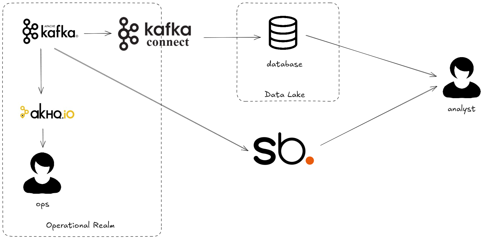

# The Real-time FOMO Problem

Are your competitors benefiting from datasets you can't see? Real-time data powers the world but 
only a fraction of it is available for analytics. If you want the full, current view of the data 
inside your business you need Streambased.

## Environment

This demo simulates a typical e2e data flow from creation in Kafka through to use for analytics in 
a data lake. The architecture diagram can be seen below:



All of this is exists in a single docker-compose environment containing:

* kafka1, zookeeper and schema-registry - The Kafka environment
* shadowtraffic - A data generator
* connect - A Kafka Connect worker responsible for transferring data from Kafka to the "Data Lake"
* streambased-server - A Streambased instance
* db - A MySQL database
* pipeline - A container for extra data pipeline steps (unused)
* superset - A Database client and visualisation tool that can work with Streambased and the "Data Warehouse"
* akhq - An operational tool for use with Kafka
* dbt - A dbt instance for handling external pipelines (unused)

## How it works

This demo simulates data collection into Kafka and further processing into a data lake. The steps 
are as follows:

1. Data is landed into Kafka
2. Kafka connect extracts that data and loads into Data Lake (ELT)
3. A user interacts with a limited dataset in the warehouse 

With Streambased the pipeline is shortened:

1. Data is landed into Kafka
2. A user interacts with the data directly in Kafka

## Steps

### Setting the scene

Imagine you are tasked with improving the customer experience for our retail store. To do this we 
need to perform an ad-hoc investigation into the habits of the largest spending customers. Let's 
use our environment to do this.


### Step 1: Start the environment

To start the environment run:

```bash
./bin/start.sh 2_fomo
```

### Step 2: Open Superset

From a browser navigate to `http://localhost:8088`

Log in with credentials:

username: admin
password: admin

Navigate to SQL -> SQL Lab

### Step 3: Let's investigate using the lake

Let's try and find the top 3 spending customers.

From the `Database` dropdown on the left hand side select `Warehouse`.

Run the following query:

```SQL
SELECT customerid, sum(amount) AS total FROM purchases GROUP BY customerid ORDER BY total DESC LIMIT 3;
```

### Step 4: Query from Streambased

Unfortunately this doesn't give us a lot to go on. We need more information about the habits of these 
customers. You have a hypothesis that the experience is a lot better on some devices than others and 
want to test this. Unfortunately this information is not available in the lake but is tracked (for 
performance optimisation purposes) in Kafka. Let's use that dataset and complete our investigation.

From the `Database` dropdown on the left hand side select `Streambased` and select `default` from 
the schema dropdown. 

There are more datasets available here:

```SQL
SHOW TABLES;
```

We can run the previous query directly against Kafka with Streambased:

```SQL
SELECT customerid, sum(amount) AS total FROM purchases GROUP BY customerid ORDER BY total DESC LIMIT 3;
```

but this time we can leverage our new dataset. e.g.:

```SQL
SELECT useragent, count(useragent) FROM requestlog WHERE customerid='CU-1277' GROUP BY useragent;
```

### Step 5: Note the difference

Using the extra information made available from Streambased we can answer our question regarding 
the devices used by our biggest spending customers. The data is available easily and immediately. 
Taking the traditional approach and landing the data into the lake would have required much more 
effort than this demo shows.
