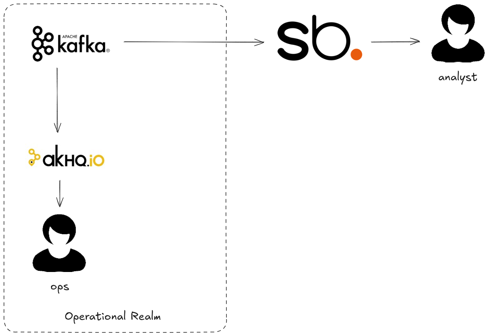

# The Black Box Problem

Kafka is opaque! Messages go in and messages come out but what happens in the middle is largely 
invisible. How do you find that poison pill? How do you know which is the bad actor client? How do 
you assemble usage reports for billing? Streambased opens the box and shines a light on your Kafka 
data.

## Environment

This demo simulates a typical operational use case in Kafka, we are simulating a shopify style 
retail company where users host shops for their goods on our platform. The architecture looks 
like this:



All of this is exists in a single docker-compose environment containing:

* kafka1, zookeeper and schema-registry - The Kafka environment
* shadowtraffic - A data generator
* connect - A Kafka Connect worker (unused)
* streambased-server - A Streambased instance
* db - A MySQL database (unused)
* pipeline - A container for extra data pipeline steps (unused)
* superset - A Database client and visualisation tool that can work with Streambased and the "Data Warehouse"
* akhq - An operational tool for use with Kafka
* dbt - A dbt instance for handling external pipelines (unused)

## How it works

This demo simulates data usage in via Kafka for operational purposes. Streambased is then used to 
observe data inside Kafka

## Steps

### Setting the scene

We like all of our demos to be as realistic as possible so this one draws from our founder's 
experience working for a bank in the early 2010's.

One night he was paged at 3am and informed that a nightly job (before the rise of streaming) that 
loaded exchange rate data into one of the bank's systems was failing.

After investigation, we found that the Zimbabwe dollar had devalued so far that it's exchange rate 
with some currencies was so large it would not fit in the database column assigned for this purpose.

Join us in this demo as we investigate a similar circumstance in a retail environment powered by 
Kafka and not only detect the issue but look to prevent it happening for other currencies in the 
future.

### Step 1: Start the environment

To start the environment run:

```bash
./bin/start.sh 3_black_box
```

### Step 2: Open Superset

From a browser navigate to `http://localhost:8088`

Log in with credentials:

username: admin
password: admin

Navigate to SQL -> SQL Lab

### Step 3: Use Streambased to investigate

We know there is an issue with store: 'ZZ-123' so let's start our investigation there.

From the `Database` dropdown on the left hand side select `Streambased` and select `default` from 
the schema dropdown. 

There are more datasets available here:

```SQL
SELECT * FROM transactions WHERE storeid='ZZ-123';
```

> 📝 This query takes advantage of Streambased acceleration. Streambased created an index over the underlying topic
> meaning only records with the designated criteria are fetched from Kafka. This query is typically 30x-50x faster than
> it's equivalent without acceleration. If you wish to compare with an unindexed version run 
> `SET SESSION use_streambased=false;` immediately before execution.

### Step 4: Investigate further

Something's clearly not right here. All the transactions for our store have a 0 amount. That's not valid 
and probably why the payment processing is failing.

Let's take a look at the payment terms associated with our shop's transactions. To do this we will 
join the transactions and payment_terms topics:

```SQL
SELECT * FROM transactions t JOIN payment_terms p ON t.paymenttermcode = p.termcode WHERE t.storeid='ZZ-123'
```

### Step 5: Confirm the issue

Here we can clearly see the problem! The exchangerate column shows a huge value meaning it's likely 
that any currency conversion will result in a 0 amount. However, we have not yet determined the scope of the problem, 
does it only affect `ZWD` or are other payment codes affected? We can check the total amount of sales for each code 
to confirm:  

```SQL
SELECT paymentTermCode, sum(amount) FROM transactions GROUP BY paymentTermCode;
```

> 📝 This query takes advantage of Streambased acceleration. Streambased pre-calculated sum/max/min/count for blocks of 
> Kafka data ahead of query time. This query is typically 10x faster than it's equivalent without acceleration. If you 
> wish to compare with an unindexed version run `SET SESSION use_streambased=false;` immediately before execution.

That confirms it, this is clearly an anomaly as only `ZWD` shows a zero total. We can now take immediate action, most 
likely suspending sales in ZWD.

### Shutting down

To stop the environment run:

```bash
./bin/stop.sh
```