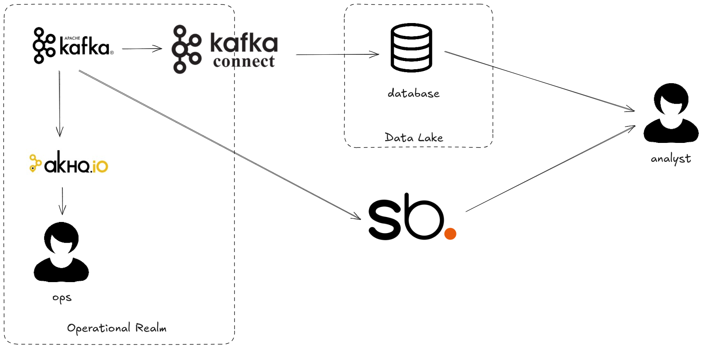

# The Two Generals Problem

The two generals problem https://en.wikipedia.org/wiki/Two_Generals%27_Problem is a popular CS 
exercise where two actors must make a decision (whether to attack) based on potentially different 
information sets. This exercise is played out daily in your data estate with the operational 
general (in charge of online apps) and the analytical general (in charge of offline) working on 
different views of the world. As the emperor, which of these you do you trust when they advise 
different things? With Streambased there is only one source of truth and a consistent view for 
both online and offline workloads.

## Environment

This demo simulates a typical e2e data flow from creation in Kafka through to use for analytics in 
a data lake. The architecture diagram can be seen below:



All of this is exists in a single docker-compose environment containing:

* kafka1, zookeeper and schema-registry - The Kafka environment
* shadowtraffic - A data generator
* connect - A Kafka Connect worker responsible for transferring data from Kafka to the "Data Lake"
* streambased-server - A Streambased instance
* db - A MySQL database
* pipeline - A container for extra data pipeline steps, this simulates external influence on the Data Lake by rogue clients
* superset - A Database client and visualisation tool that can work with Streambased and the "Data Warehouse"
* akhq - An operational tool for use with Kafka
* dbt - A dbt instance for handling external pipelines (unused)

## How it works

This demo simulates data collection into Kafka and further processing into a data lake. The steps 
are as follows:

1. Data is landed into Kafka
2. Kafka connect extracts that data and loads into Data Lake (ELT)
3. A user interacts with the dataset in the warehouse 

With Streambased the pipeline is shortened:

1. Data is landed into Kafka
2. A user interacts with the data directly in Kafka

This demo accepts that Kafka is not the only influence on the Data Lake, other influences can cause 
the Streambased and Lake paths to drift from eachother. 

## Steps

### Step 1: Start the environment

To start the environment run:

```bash
./bin/start.sh 4_two_generals
```

### Step 2: Open Superset

From a browser navigate to `http://localhost:8088`

Log in with credentials:

username: admin
password: admin

Navigate to SQL -> SQL Lab

### Step 3: Initially consistent

Initially queries from Streambased and the Data Lake are consistenct 

From the `Database` dropdown on the left hand side select `Warehouse`.

Run the following query:

```SQL
SELECT customerid, sum(amount) AS total FROM purchases GROUP BY customerid ORDER BY total DESC LIMIT 3;
```
Now run the same with Streambased: 

From the `Database` dropdown on the left hand side select `Streambased` and select `default` from
the schema dropdown.

```SQL
SELECT customerid, sum(amount) AS total FROM purchases GROUP BY customerid ORDER BY total DESC LIMIT 3;
```

### Step 4: Drift

After a little while the two source start to drift. Repeat the queries from step 3 to notice this.

Which source is correct, which do you trust?

