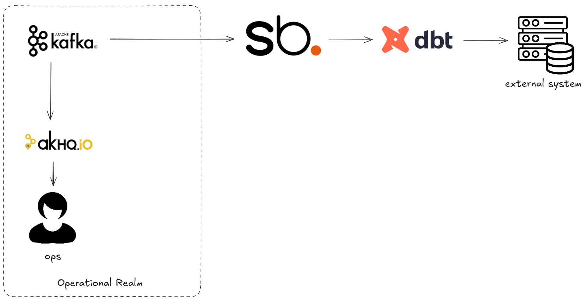

# The Batch Problem

I have an external customer who's specced a daily batch fetch job for my data. The data is in Kafka, 
how do I give to them?

## Environment

This demo simulates data collection in Kafka, this will then be provided by and industry standard 
pipeline ochestrator (dbt) to an external system. Streambased will be used to fetch the data via 
SQL.



All of this is exists in a single docker-compose environment containing:

* kafka1, zookeeper and schema-registry - The Kafka environment
* shadowtraffic - A data generator
* connect - A Kafka Connect worker (unused)
* streambased-server - A Streambased instance
* db - A MySQL database (unused)
* pipeline - A container for extra data pipeline steps (unused)
* superset - A Database client and visualisation tool that can work with Streambased and the "Data Warehouse"
* akhq - An operational tool for use with Kafka
* dbt - A dbt instance for handling external pipelines

## How it works

In this demo we will build a dbt pipeline that will extract data from Kafka using Streambased 

## Steps

### Step 1: Start the environment

To start the environment run:

```bash
./bin/start.sh 5_batch
```

### Step 2: Setup dbt

We create a new DBT project in our dbt container:

```bash
cd environment
docker-compose exec dbt dbt init
```
enter the project name: streambased_dbt and choose the trino database

### Step 3: Create a profile

Next we define how DBT connects to Streambased, for simplicity we have included a pre-configured profile with this demo:

```text
streambased_dbt:
    target: dev
    outputs:
        dev:
            type: trino
            method: none
            user: e30=
            database: kafka
            host: streambased-server
            port: 8080
            schema: streambased
            threads: 1
```

let's copy it into our new project

```bash
docker compose exec dbt cp /etc/dbtConfig/profiles.yml streambased_dbt
```

### Step 4: Configure the source query

Our pipeline will execute the following SQL against Kafka with Streambased. Our pipeline will execute:

```sql
SELECT customerId, sum(amount) FROM kafka.default.purchases GROUP BY customerId ORDER BY customerId;
```

Let's install it:

```bash
docker-compose exec dbt cp /etc/dbtConfig/src_purchases.sql streambased_dbt/models
```


### Step 5: Run the pipeline

Now let's ask DBT to simulate a run and show us what the output would be:

```bash
docker-compose exec --workdir /streambased_dbt dbt dbt show --select models/src_purchases.sql
```
