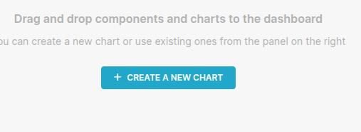

# Streambased All In One Demo

This demo shows the full complement of Streambased technologies using simple, inch deep examples. For more business 
case focused examples please see the other demos in this repository.

This demo will showcase:

1. Accessing Kafka data as if it was an S3 filesystem
2. Accessing Kafka data as if it was an Iceberg Table
3. Accessing Kafka data as if it was ANSI SQL compatible database.

All of the above access patterns will utilise Streambased indexing to accelerate performance and all will use only Kafka as a data source (no ETL is involved in any of these demos)

## Environment

This demo simulates an operational environment in Kafka, we are simulating a shopify style 
retail company where users host shops for their goods on our platform. The demo is deployed as a single docker-compose environment comprising of:

Core Kafka services:

* kafka1, zookeeper and schema-registry - The Kafka environment
* shadowtraffic - A data generator

In addition to this following Streambased tools are deployed:

* streambased-server - A Streambased SQL engine instance
* directstream - A Streambased -> Iceberg projection instance

And the following client tools:

* superset - A Database client and visualisation tool that can work with many data sources (including Streambased)
* akhq - A simple operational tool for exploring Kafka
* spark-iceberg - A Spark deployment and python notebook for working with Iceberg tables
* s3manager - A simple web based S3 client

## Setup

To start the demo run:

```bash
./bin/start.sh 6_all_in_one
```

We need to ensure there is a suitably large dataset available to the demo and this can take time to build. Please go to 
`localhost:9090` and ensure that there are two topics available (`transactions` and `payment_terms`) with the message 
counts below:


You may also notice the consumser groups: `Streambased-Indexer-default` and `Streambased-Indexer-streambased`. These 
are performing a single pass over the data in order to construct indexes that will accelerate access to the data. If 
you wish to know more about how this works read [here](https://www.streambased.io/blog/indexing).

## Section 1 - surfacing Kafka data

### As a S3 filesystem.

Streambased allows chunks of offsets in a topic to be represented as files via a S3 filesystem proxy. An S3 client can 
view topics as if they were S3 buckets and will see a number of files sliced by offset chunk inside. Streambased uses 
a naming convention to easily identify the contents of the file. For instance a file that represents offsets 100-1100 
of partition 0 would be named `0-100-1100.avro`. Streambased also uses a directory structure to represent the chunking 
used so that 1 topic can be chunked in multiple ways. For instance `/1000/0-100-1100.avro` is a file in a directory 
representing chunks of 1000 offsets. Similarly `/100/0-100-200.avro` represents 100 offset chunking. 

Note that these files do not actually exist and hold no data. Only when they are downloaded by a client is the data 
fetched from Kafka and returned.

We can use the packaged s3manager client to explore our topics. Navigate to `localhost:9180` to see our S3 buckets:


Within each bucket we see files corresponding to Kafka data, these can be downloaded and worked with locally. 


### As an Iceberg table.

The main reason for the above functionality is to support Apache Iceberg tables. Iceberg consists of a set of data 
files and a set of metadata files tht describe access to them. We have already created the data files above and 
Streambased goes further to create ephemeral metadata files to allow Iceberg client to interact with it. What's more 
we can use Streambased indexing to power features like partitioning within the Iceberg spec.

In this demo our Iceberg client will be Spark-SQL and you can experience this from within a python notebook. To access 
this go to `localhost:8888/notebooks/notebooks/ISK-quick-start.ipynb` 

Run through the notebook to see it in action.


### As a database

Up until now, the primary customer of Streambased technology has been data engineering focused. Streambased also 
provides an easy entrypoint into Kafka data using its A.S.K. (Analytics Service for Kafka) SQL engine. This surfaces a 
JDBC/ODBC endpoint to plug Kafka data directly into your BI applications and benefit from Streambased acceleration. 
The following is a short demo of it's use with the common Superset BI tool.

#### Setting the scene

We like all of our demos to be as realistic as possible so this one draws from our founder's 
experience working for a bank in the early 2010's.

One night he was paged at 3am and informed that a nightly job (before the rise of streaming) that 
loaded exchange rate data into one of the bank's systems was failing.

After investigation, we found that the Zimbabwe dollar had devalued so far that it's exchange rate 
with some currencies was so large it would not fit in the database column assigned for this purpose.

Join us in this demo as we investigate a similar circumstance in a retail environment powered by 
Kafka and not only detect the issue but look to prevent it happening for other currencies in the 
future.

#### Open Superset

From a browser navigate to `http://localhost:8088`

Log in with credentials:

username: admin
password: admin

Navigate to SQL -> SQL Lab

#### Use Streambased to investigate

We know there is an issue with store: 'ZZ-123' so let's start our investigation there.

From the `Database` dropdown on the left hand side select `Streambased` and select `default` from 
the schema dropdown. 

There are more datasets available here:

```SQL
SELECT * FROM transactions WHERE storeid='ZZ-123';
```

> 📝 This query takes advantage of Streambased acceleration. Streambased created an index over the underlying topic
> meaning only records with the designated criteria are fetched from Kafka. This query is typically 30x-50x faster than
> it's equivalent without acceleration. If you wish to compare with an unindexed version run 
> `SET SESSION use_streambased=false;
> SELECT * FROM transactions WHERE storeid='ZZ-123';` If
> you wish to know more about how this works read [here](https://www.streambased.io/blog/indexing).
> remember to revert this by running `SET SESSION use_streambased=true;` before continuing


#### Investigate further

Something's clearly not right here. All the transactions for our store have a 0 amount. That's not valid 
and probably why the payment processing is failing.

Let's take a look at the payment terms associated with our shop's transactions. To do this we will 
join the transactions and payment_terms topics:

```SQL
SELECT * FROM transactions t JOIN payment_terms p ON t.paymenttermcode = p.termcode WHERE t.storeid='ZZ-123'
```


#### Confirm the issue

Here we can clearly see the problem! The exchangerate column shows a huge value meaning it's likely 
that any currency conversion will result in a 0 amount. However, we have not yet determined the scope of the problem, 
does it only affect `ZWD` or are other payment codes affected? We can check the total amount of sales for each code 
to confirm:  

```SQL
SELECT paymentTermCode, sum(amount) FROM transactions GROUP BY paymentTermCode;
```

> 📝 This query takes advantage of Streambased acceleration. Streambased pre-calculated sum/max/min/count for blocks of 
> Kafka data ahead of query time. This query is typically 10x faster than it's equivalent without acceleration.
> If you wish to know more about how this works read [here](https://www.streambased.io/blog/indexing).


That confirms it, this is clearly an anomaly as only `ZWD` shows a zero total. We can now take immediate action, most 
likely suspending sales in ZWD.

#### Build a dashboard

We can also use Streambased to build a dashboard from Kafka data in a standard way with no code required. Go to 
`http://localhost:8088/dashboard/list/` and click `+ Dashboard`.


Now click `+ Create New Chart`. 



We will need a dataset for our chart. Find `Add a dataset` and fill it out as below:


Select a `Bar Chart` and click `Create New Chart`

Fill out the chart details as follows:

X-Axis: itemcode
Metrics: SUM(amount)
Filters: storeid = 'ZZ-124'

On clicking `Create Chart` you should see something similar to the below:


Go ahead and name your chart and add to your dashboard.

## Summary

This demo showcases how Streambased enables direct, high-performance analytics on Kafka data without requiring ETL. 
We saw how Kafka topics can be accessed through three familiar paradigms: as a virtual S3 filesystem, as Apache 
Iceberg tables, and as a fully ANSI SQL-compatible database. Each of these access patterns is powered by 
Streambased indexing technology, which dramatically accelerates queries to typically 30 to 
100 times faster than their unaccelerated equivalents.

The demo also shows a realistic business scenario: identifying and resolving an issue involving anomalously high 
exchange rates (such as the Zimbabwean dollar) that result in zero-value transactions. This investigation is carried 
out using standard BI tools and practices that would not normally be available to Kafka users. It culminates in 
building a live dashboard—all without writing code or moving data outside Kafka.

Together, these capabilities demonstrate how Streambased brings modern, self-service analytics to streaming data, 
making Kafka accessible to data engineers, analysts, and BI users alike. Most importantly, no ETL processes were 
involved in any of the above, everything interacts with live Kafka data in real time.


