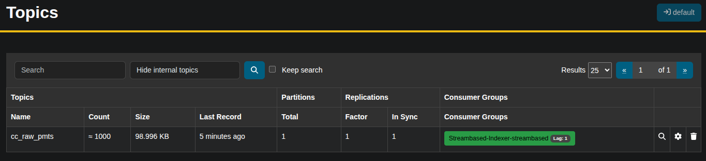
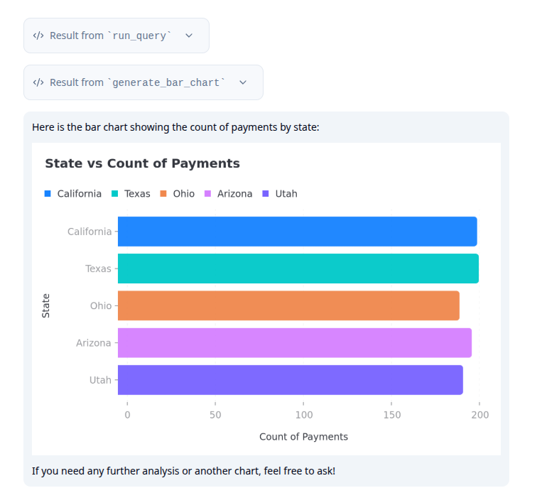

# Streambased MCP

The Streambased MCP server provides a bridge between your Streambased Server (and by extension your Kafka data) and your 
AI agents. It champions the principle of "Vibe Coding for Data" whereby a business stakeholder can investigate data 
directly using natural language rather than involving a Data Scientist/Analyst in the middle. 

In this demo we will investigate a small sample dataset before constructing a simple chart report of the results of 
our investigation. 

## Environment

This demo simulates a typical operational environment in Kafka. All of this is exists in a single docker-compose 
environment containing:

* kafka1, zookeeper and schema-registry - The Kafka environment
* shadowtraffic - A data generator
* streambased-server - A Streambased instance
* superset - A Database client and visualisation tool that can work with Streambased and the "Data Warehouse"
* akhq - An operational tool for use with Kafka

plus 2 more containers specific to the MCP demo:

* streambased-mcp - an instance of a mcp server for Streambased
* streambased-mcp-client - a simple mcp client that provides a wbe interface and graphing capabilities

## Setup

This demo requires an OpenAI account (free tier is fine). To create this follow the instructions 
[here](https://platform.openai.com/api-keys) and add your api key to `/cases/7_mcp/mcp.env`

## Steps

### Step 1: Start the environment

To start the environment run:

```bash
./bin/start.sh 7_mcp
```

### Step 2: Check the data

From a browser navigate to `http://localhost:9090`

You should see a topic named `cc_raw_pmts` with 1000 records and an associated schema:



### Step 3: Use Streambased to investigate the data

Navigate to `localhost:3000` to access the Streambased MCP client. You can now interact with the data using natural 
language. We suggest a good starting point is to get a description of the data:

```text
What data can I query?
```


### Step 4: Investigate further

We can ask questions of that data interactively. Try poking around a bit e.g.

```text
How many payments came from CA?
```

### Step 5: Create a chart

With the Streambased MCP client we can also produce charts of our queries for reporting. Try:

```text
Create a bar chart of state vs count of payments
```

You will see the client orchestrate fetching of the results and creation of charts with the fetched dataset:



### Shutting down

To stop the environment run:

```bash
./bin/stop.sh
```