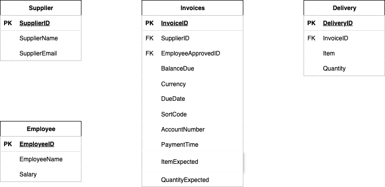

# Streambased MCP

The Streambased MCP server provides a bridge between your Streambased Server (and by extension your Kafka data) and your
AI agents. It champions the principle of "Vibe Coding for Data" whereby a business stakeholder can investigate data
directly using natural language rather than involving a Data Scientist/Analyst in the middle.

In this demo we will investigate a small sample dataset before constructing a simple chart report of the results of
our investigation.

## Environment

This demo simulates a typical operational environment in Kafka. All of this is exists in a single docker-compose
environment containing:

* kafka1, zookeeper and schema-registry - The Kafka environment
* shadowtraffic - A data generator
* streambased-server - A Streambased instance
* superset - A Database client and visualisation tool that can work with Streambased and the "Data Warehouse"
* akhq - An operational tool for use with Kafka

plus 2 more containers specific to the MCP demo:

* streambased-mcp - an instance of a mcp server for Streambased
* streambased-mcp-client - a simple mcp client that provides a wbe interface and graphing capabilities

## Setup

This demo requires an OpenAI account (free tier is fine). To create this follow the instructions
[here](https://platform.openai.com/api-keys) and add your api key to `/cases/7_mcp/mcp.env`

## Steps

### Step 1: Start the environment

To start the environment run:

```bash
./bin/start.sh 7_mcp
```


### Step 2: Wait for Superset to find the database
Navigate to `localhost:8088`. 
At first it will come up with an error, periodically refresh it until the page loads.
Once the page loads select SQL labs from the navbar.
Reload periodically until the database is found (may need to manually select the database).

SQL queries can be run from here and the schema can be checked. 

### Step 3: Communicate with the AI agent
Navigate to `localhost:3000`.
There is a sample query at the top that you may run, though you may run any query you like at the bottom of the screen.

## Example Investigation:



[Example_Investigation.mov](media/Example_Investigation.mov)

## Notes

Technically the only scam that occurs here is the invoice that does not have a delivery attached to it.
However, for the purposes of this demonstration that is not important.
All that is being demonstrated is that the AI agent can search for these kinds of discrepancies.

### Shutting down

To stop the environment run:

```bash
./bin/stop.sh
```