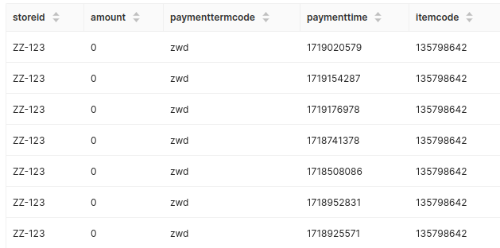

# Streambased Retail Demo

## What does this demo do?

We like all of our demos to be as realistic as possible so this one draws from our founder's 
experience working for a bank in the early 2010's. 

One night he was paged at 3am and informed that a nightly job (before the rise of streaming) 
that loaded exchange rate data into one of the bank's systems was failing.

After investigation, we found that the Zimbabwe dollar had devalued so far that it's exchange 
rate with some currencies was so large it would not fit in the database column assigned for 
this purpose. 

Join us in this demo as we investigate a similar circumstance in a retail environment powered 
by Kafka and not only detect the issue but look to prevent it happening for other currencies 
in the future.

## Step 1: The setup

You help to maintain a retail platform powered by Kafka this platform hosts its customer's shops 
and provides stock, payment and advertising services for them. As an analyst in this company, you
have just received an alert. One of your customers (store id: ZZ-123) is not able to process 
payments. Before we dive in and investigate let's take a look at the technical situation. 

Our physical environment consists of the following components:

1. A Kafka cluster (containers kafka1 and zookeeper) - for data storage
2. A Schema Registry - a catalog that holds the structure of the Kafka messages
3. ShadowTraffic - a best of breed data generation solution
4. Streambased Server - our wonder tool to make the Kafka data available via SQL/JDBC
5. Superset - a popular and easy to use database client
6. Jupyter notebooks - a popular data science platform for developing predictive models

Our logical environment consists of the following topics:

1. transactions - a firehose topic containing every transaction for every store made on the platform
2. payment_terms - a topic holding reference data around how payments are made

## Step 2: Start the environment

To bring up the environment run:

```bash
./bin/start.sh
```

## Step 3: Inspect the environment

We can list our topics using the Kafka console tools

```bash
docker-compose exec kafka1 kafka-topics --bootstrap-server kafka1:9092 --list
```

And see the amount of data on the topics using the kafka-consumer-groups command:

```bash
docker-compose exec kafka1 kafka-consumer-groups --bootstrap-server kafka1:9092 --describe --group Streambased-Indexer
```

The data gen process will produce 2,501,000 messages to the `transactions` topic and 2000 
messages to the `payment_terms` topic to populate our demo

We can view topic schemas via the Schema Registry REST API:

```bash
docker-compose exec kafka1 curl schema-registry:8081/subjects
docker-compose exec kafka1 curl schema-registry:8081/subjects/transactions-value/versions/latest
docker-compose exec kafka1 curl schema-registry:8081/subjects/payment_terms-value/versions/latest
```

## Step 4: All of the above but easier ;-)

The console tools above are complex to install and often not an option in secure environments. 
Thanks to Streambased the same information can be discovered from a simple SQL interface. We 
will use Apache Superset for this but any client that supports JDBC/ODBC or SQL Alchemy can be 
used in its place.

To log into superset navigate to `localhost:8088` and use credentials `admin:admin`

The under the `SQL` tab, select `SQL Lab` and select the `streambased` schema

Now we can describe our topics by running these statements (run the 1 at a time):

```bash
use kafka.streambased;
show tables;
```

And see how much data is contained by running:

```bash
select count(*) from transactions;
select count(*) from payment_terms;
```

And see their structure from:

```bash
describe transactions;
describe payment_terms;
```

This is a much easier to use interface with far less risky than the overly powerful console tools.

## Step 4: Back to the story

So we know there is an issue with shop `ZZ-123`, let's use SQL to select transactions related 
to this shop,

```bash
select * from transactions where storeid='ZZ-123';
```

<strong>Sidenote:</strong> This query runs really fast due to Streambased acceleration, if you wish to see how 
slow it is without Streambased run:

```bash
set session use_streambased=false;
select * from transactions where storeid='ZZ-123';
```

but remember to re-enable Streambased acceleration with:

```bash
set session use_streambased=true;
```



Something's clearly not right here. All the transactions for our store have a 0 amount. That's 
not valid and probably why the payment processing is failing.

## Step 5: Diving deeper

Let's take a look at the payment terms associated with our shop's transactions. To do this we will 
join the `transactions` and `payment_terms` topics:

```bash
select * from transactions t join payment_terms p on t.paymenttermcode = p.termcode where t.storeid='ZZ-123'  
```

here we can clearly see the problem! The `exchangerate` column shows a huge value meaning it's 
likely that any currency conversion will result in a 0 amount. However, just to sanity check 
let's find the average exchange rate across the other payment terms:

```bash
select avg(exchangerate) from payment_terms where termcode != 'zwd'
```

That confirms it, this is clearly an anomaly, and we can take immediate action. The most 
likely solution is to suspend sales in ZWD. 

## Step 6: Prevention is the best cure

We can take this process one step further by using streambased to develop a model that will 
predict future exchange rates so that we can automatically disable them before payments fail.

An ideal tool for prototyping this Jupyter, a notebook tool that can leverage powerful python 
libraries for statistical analysis. Streambased integrates seamlessly into this tool to provide 
data directly from Kafka. 

To see a sample notebook log in at `localhost:8888` with password `Streambased` and open the 
notebook named `ExchangeRatePredictor.ipynb` in the `notebooks` directory.

This README will not provide a detailed explanation of all the operations performed in the 
notebook but a general set of steps is as follows:

1. Execute a SQL statement against Kafka extracting exchange rate updates for a given currency
2. Calculate lines of best fit
3. Plot the data set and trend lines
4. Calculate a predicted exchange rate 6 months in the future using the trend lines.

## Summary

In this demo we performed a fictitious investigation into a production issue from a retail 
platform by executing SQL queries on Kafka data using Streambased. By exploring our data set 
with industry standard tools we were able to quickly and easily diagnose the issue and 
prototype an automated solution to ensure it never occurs again.
